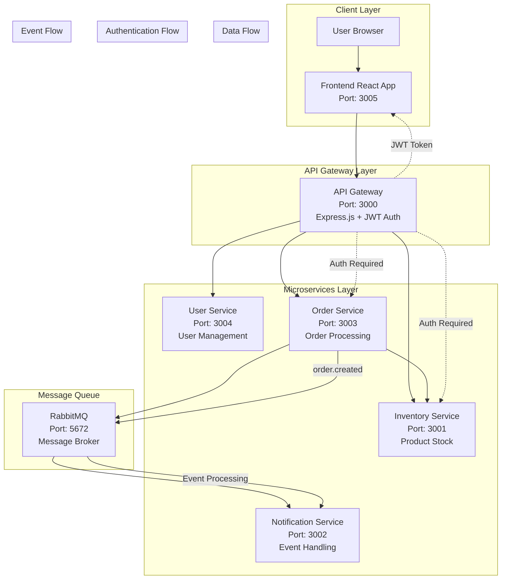

# Shopping Website Microservices Architecture

## System Architecture Diagram

## Service Interactions

### 1. User Registration & Authentication
- **Frontend** → **API Gateway** → **User Service**
- Creates new users and manages user data
- JWT tokens for authentication

### 2. Product Browsing
- **Frontend** → **API Gateway** → **Inventory Service**
- Displays available products and stock levels
- Real-time inventory checking

### 3. Order Processing
- **Frontend** → **API Gateway** → **Order Service**
- **Order Service** → **Inventory Service** (reserve stock)
- **Order Service** → **RabbitMQ** (publish events)
- **RabbitMQ** → **Notification Service** (process events)

### 4. Event-Driven Notifications
- Order creation triggers events
- RabbitMQ handles message queuing
- Notification service processes events asynchronously

## Technology Stack

### Frontend
- **React 18** with Next.js 14
- **Tailwind CSS** for styling
- **Framer Motion** for animations
- **Axios** for API calls
- **React Hot Toast** for notifications

### Backend Services
- **Node.js** with Express.js
- **JWT** for authentication
- **RabbitMQ** for message queuing
- **Circuit Breaker** pattern for resilience

### Infrastructure
- **Docker** containerization
- **Docker Compose** for orchestration
- **Microservices** architecture
- **API Gateway** pattern

## Port Configuration

| Service | Port | Description |
|---------|------|-------------|
| Frontend | 3005 | React application |
| API Gateway | 3000 | Main entry point |
| User Service | 3004 | User management |
| Inventory Service | 3001 | Product inventory |
| Order Service | 3003 | Order processing |
| Notification Service | 3002 | Event handling |
| RabbitMQ | 5672 | Message broker |
| RabbitMQ Management | 15672 | Management UI |

## Key Features

1. **Modern UI**: Interactive React frontend with Tailwind CSS
2. **Microservices**: Independent, scalable services
3. **Event-Driven**: Asynchronous processing with RabbitMQ
4. **Authentication**: JWT-based security
5. **Resilience**: Circuit breaker patterns
6. **Containerized**: Docker-based deployment
